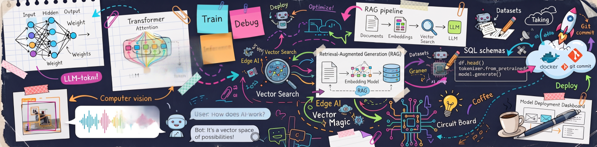

  

<h1 align="center">Hey, I'm Gopika!!</h1>

  <b>AI/ML Engineer in the Making • DSA Enthusiast</b>

  <i>Training ideas into reality.</i>

I'm an AI & Machine Learning student passionate about building intelligent applications that solve real-world problems. I love blending AI with backend development and continuously learning through projects, research, and problem-solving.

### Languages and Tools

  
  
  
  

---

## Achievements

- 🏅 Top 25 Finalist — **TruthTell Hackathon**
- 🧩 Finalist — **Reverse Coding, Shaastra, IIT Madras**
## Connect me

  
  

  

